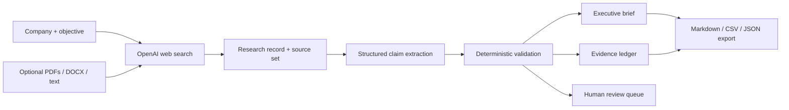
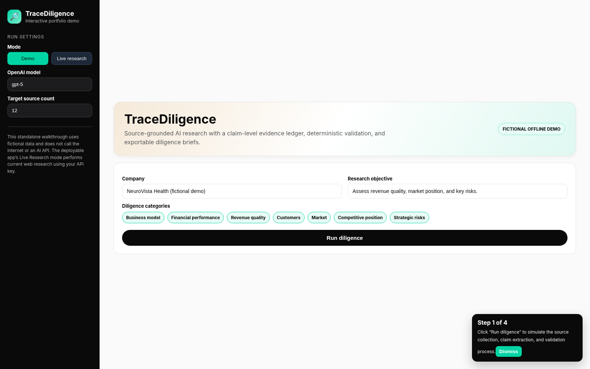
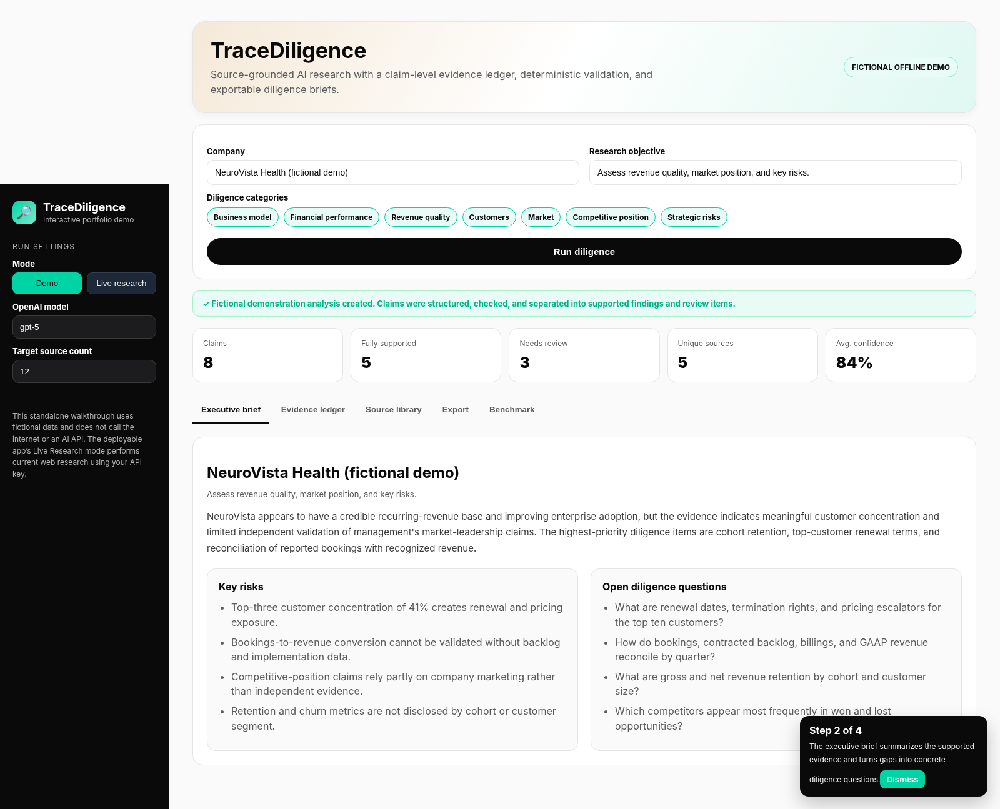
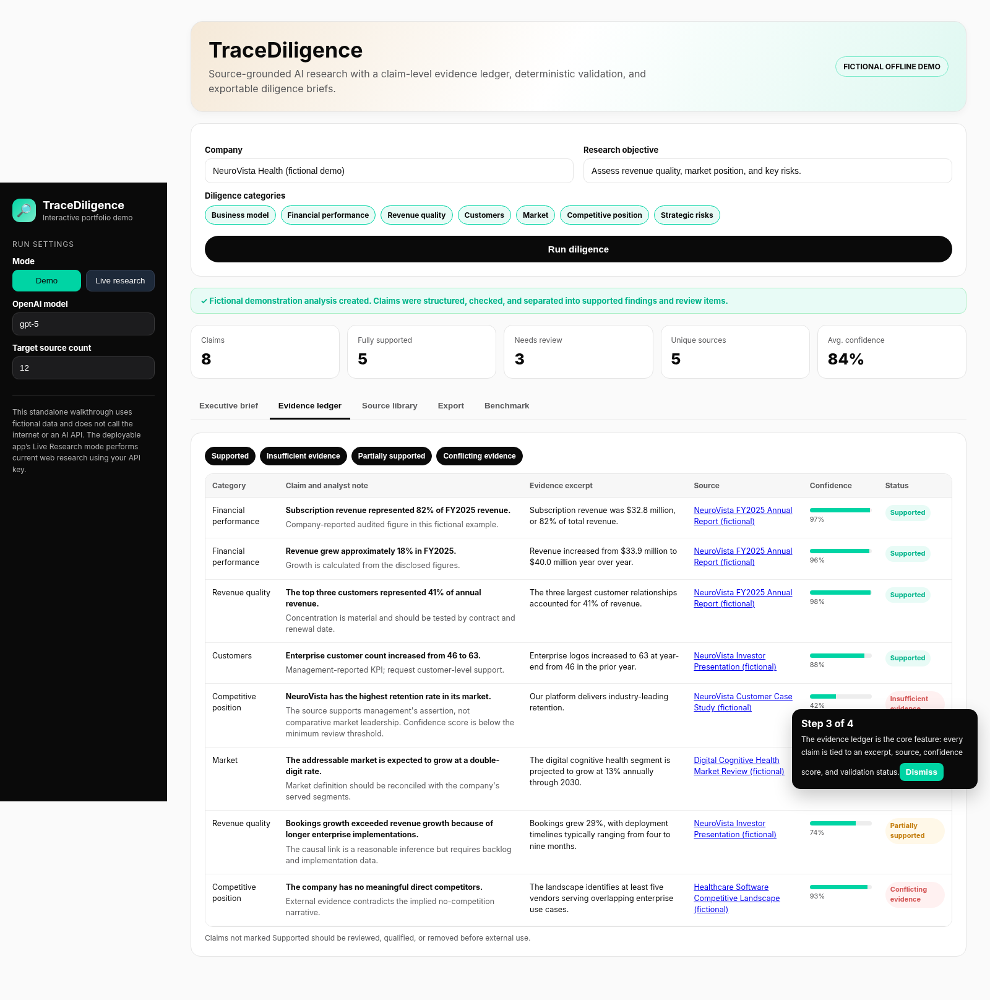

# TraceDiligence

**A source-grounded AI research and commercial due-diligence workflow.**

TraceDiligence researches a company, converts the research into a claim-level evidence ledger,
checks citation provenance and source quality, flags weak or conflicting claims, and exports an
auditable diligence brief.

> The included demo is fictional. Live mode is disabled by default and requires an OpenAI API key and uses the OpenAI
> Responses API with web search, followed by a structured-output pass.

## Why this project exists

Most AI research demos optimize for fluent answers. TraceDiligence optimizes for auditability:

- Every material claim is mapped to a source URL and evidence excerpt.
- Unsupported, low-confidence, or weakly sourced claims are downgraded for human review.
- Contradictions and analytical inferences remain visible rather than being silently removed.
- Results can be exported as a Markdown brief, CSV evidence ledger, or structured JSON.
- A benchmark calculator helps test time reduction, source coverage, and citation accuracy.

## Application workflow




## Product preview

### Research input



### Executive brief



### Evidence ledger



## Features

- Fictional demo mode requiring no API key
- Mintlify-inspired black, mint, and neutral interface theme
- Live current-web research using the OpenAI Responses API
- Optional PDF, DOCX, text, Markdown, and CSV ingestion
- Claim-level source links and evidence excerpts
- Six validation states: Supported, Partially supported, Conflicting evidence,
  Insufficient evidence, Outdated source, and Model inference
- Deterministic URL, evidence-length, confidence, and source-reliability checks
- Downloadable evidence ledger, report, and JSON record
- Benchmark calculator for defensible resume metrics

## Run locally

### 1. Create a virtual environment

```bash
python -m venv .venv
source .venv/bin/activate          # macOS or Linux
# .venv\Scripts\activate         # Windows PowerShell
```

### 2. Install dependencies

```bash
pip install -r requirements.txt
```

### 3. Add an API key for live mode

Create `.streamlit/secrets.toml`:

```toml
ENABLE_LIVE_MODE = true
OPENAI_API_KEY = "your-api-key-here"
APP_ACCESS_CODE = "choose-a-private-access-code"
```

You can skip this step and use **Demo** mode. For a public portfolio deployment, Demo-only mode is the safest default because it prevents visitors from consuming your API credits.

### 4. Start the app

```bash
streamlit run app.py
```

## Deploy on Streamlit Community Cloud

1. Create a public GitHub repository and upload this project.
2. In Streamlit Community Cloud, create a new app from the repository.
3. Set the entrypoint to `app.py`.
4. For a safe public demo, add:

```toml
ENABLE_LIVE_MODE = false
```

5. To enable protected live research instead, use:

```toml
ENABLE_LIVE_MODE = true
OPENAI_API_KEY = "your-api-key-here"
APP_ACCESS_CODE = "choose-a-private-access-code"
```

6. Deploy and add the public URL to your GitHub README, personal website, and LinkedIn Featured section.

Do not commit `.streamlit/secrets.toml`. The included `.gitignore` excludes it. Never publish your access code or API key.

## How live mode works

1. `tracediligence/research.py` calls `client.responses.create(...)` with the `web_search` tool.
2. It collects the research narrative and source metadata returned by the response.
3. A second call uses `client.responses.parse(...)` and a Pydantic schema to create a predictable
   diligence object.
4. `tracediligence/validation.py` checks whether each cited URL exists in the collected source set,
   whether the excerpt is sufficiently specific, whether confidence is adequate, and whether the
   source type supports a strong claim.
5. The Streamlit interface presents the executive brief, evidence ledger, source library, exports,
   and benchmark calculator.

Official references:

- OpenAI web search guide: https://developers.openai.com/api/docs/guides/tools-web-search
- OpenAI structured outputs guide: https://developers.openai.com/api/docs/guides/structured-outputs
- Streamlit deployment guide: https://docs.streamlit.io/deploy/streamlit-community-cloud/deploy-your-app/deploy
- Streamlit secrets guide: https://docs.streamlit.io/deploy/streamlit-community-cloud/deploy-your-app/secrets-management

## Benchmark the resume claims

To test a statement such as “reduced initial review time by approximately 35% and expanded source
coverage by approximately 2x,” run the same defined research task manually and through the app.

Suggested protocol:

1. Freeze the company, objective, categories, and cutoff date.
2. Define what counts as a qualifying source before beginning.
3. Time both workflows from start to first review-ready output.
4. Manually verify a sample of at least 20 claim-citation pairs.
5. Preserve the prompts, outputs, timing notes, and reviewed evidence ledger.

Calculations:

```text
Time reduction = (manual minutes - AI-assisted minutes) / manual minutes
Source coverage = qualifying AI sources / qualifying manual sources
Citation accuracy = correctly supported citations / claims manually reviewed
```

Only publish the figures after completing and preserving this test.

## Repository structure

```text
TraceDiligence/
├── app.py
├── tracediligence/
│   ├── demo.py
│   ├── file_ingest.py
│   ├── models.py
│   ├── reporting.py
│   ├── research.py
│   └── validation.py
├── tests/
│   └── test_validation.py
├── sample_outputs/
├── .streamlit/
│   ├── config.toml
│   └── secrets.toml.example
├── requirements.txt
├── SETUP_CHECKLIST.md
└── LICENSE
```

## Privacy and limitations

- Do not upload confidential client material to a public instance.
- The workflow can still misread sources, confuse periods or metrics, or overstate an inference.
- Source reliability scoring is heuristic, not a substitute for professional judgment.
- Financial, legal, medical, or investment conclusions require qualified human review.
- Web content changes over time; preserve copies of evidence used for material decisions.

## Portfolio description

> Built and deployed a source-grounded AI diligence workflow that searches public information,
> extracts structured evidence, validates claim-level citations, flags contradictory or unsupported
> claims, and generates an auditable company-research brief.

## License

MIT License. See `LICENSE`.
